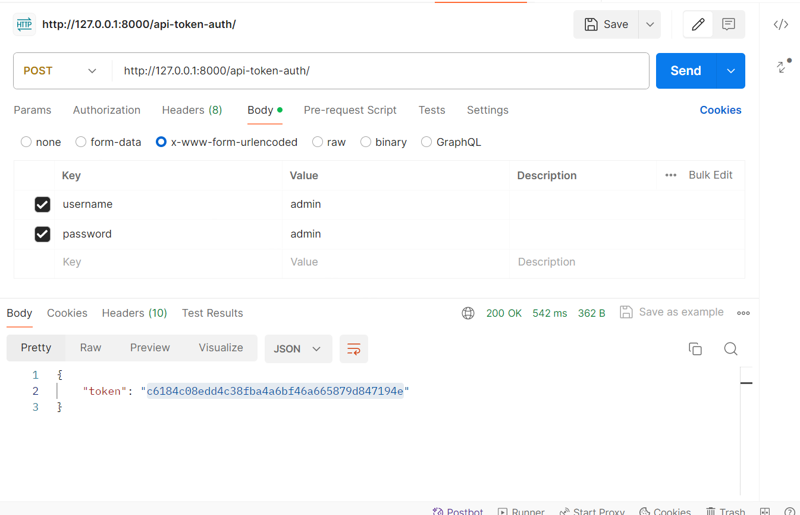
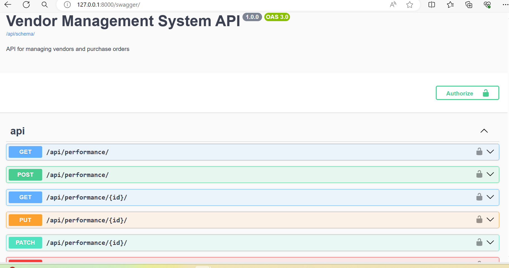
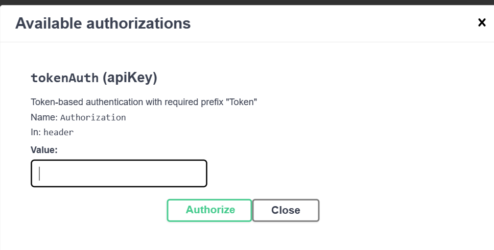

# Vendor Management System

## Description

This Vendor Management System (VMS) is built with Django and Django REST Framework. It is designed to manage vendor profiles, track purchase orders, and calculate vendor performance metrics effectively. The system offers a robust API for creating, updating, managing, and evaluating vendors and purchase orders.

## Features

- **Vendor Profile Management**: Create, retrieve, update, and delete vendor profiles.
- **Purchase Order Tracking**: Manage purchase orders with functionalities to create, retrieve, update, and delete.
- **Vendor Performance Evaluation**: Calculate and retrieve performance metrics such as On-Time Delivery Rate, Quality Rating, Response Time, and Fulfillment Rate.

## Technical Requirements

- Django (latest stable version)
- Django REST Framework
- Python 3.8 or higher
- Other dependencies are listed in the `requirements.txt` file.

## Installation

To set up the project locally, follow these steps:

1. Clone the repository:
   ```bash
   git clone https://github.com/your-github-username/vendor-management-system.git
   cd vendor-management-system
   ```
2. Install dependencies:
    ```bash
    pip install -r requirements.txt
    ```
3. Database setup:
    ```bash
   python manage.py migrate
   ```
4. Create an administrative user:
    ```bash
   python manage.py createsuperuser
    ```
5. Run the development server:
    ```bash
   python manage.py runserver
    ```
6. Navigate to:
    ```bash
   http://127.0.0.1:8000/swagger/
   http://127.0.0.1:8000/api/
    ```
## Authentication
The API uses token-based authentication to secure access. Follow these steps to generate and use a token:

### Obtain a Token:
   After creating an administrative user use same user and password, use the following endpoint to obtain your token:
   ```bash
   curl -X POST -d "username=yourusername&password=yourpassword" http://127.0.0.1:8000/api-token-auth/
   ```
### Using the Token:
   Include the token in the Authorization header of your requests:
   ```bash
   curl -H "Authorization: Token your_token_value" http://127.0.0.1:8000/api/vendors/
   ```

## API Endpoints

### Vendors:
* POST /api/vendors/: Create a new vendor.
* GET /api/vendors/: List all vendors.
* GET /api/vendors/{vendor_id}/: Retrieve specific vendor details.
* PUT /api/vendors/{vendor_id}/: Update vendor details.
* DELETE /api/vendors/{vendor_id}/: Delete a vendor.
### Purchase Orders:
* POST /api/purchase_orders/: Create a new purchase order.
* GET /api/purchase_orders/: List all purchase orders.
* GET /api/purchase_orders/{po_id}/: Retrieve specific purchase order details.
* PUT /api/purchase_orders/{po_id}/: Update a purchase order.
* DELETE /api/purchase_orders/{po_id}/: Delete a purchase order.
### Performance Metrics:
* GET /api/vendors/{vendor_id}/performance: Retrieve calculated performance metrics for a specific vendor.

## Screenshots




## Test Cases

To run the test cases, run the following command:
```
python manage.py test
```